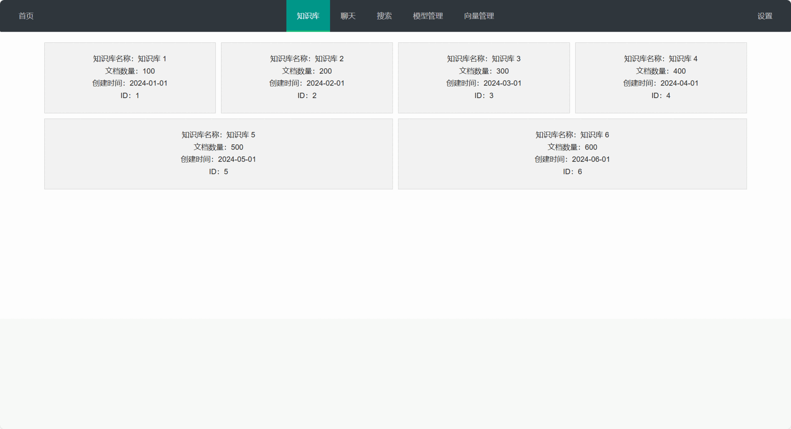

<div align="center">
<a href="">

</a>
</div>

[English](README.md) | [简体中文](README_ch.md)

# JAVA-RAG

### Introduction

RAG (Retrieval-Augmented Generation) project implemented in pure Java without relying on frameworks such as Spring Boot. It provides RAG pipelines and Agent patterns that are convenient for enterprise integration and secondary development.

> [!IMPORTANT]
> Runtime credentials must be supplied through environment variables or JVM system properties. The repository previously contained public credentials; they must be treated as compromised and rotated. See [SECURITY.md](SECURITY.md).

### Secure configuration

Copy [`.env.example`](.env.example) as a local reference and export the required values in your shell. Java-RAG does not automatically load `.env` files.

```shell
export RAG_API_KEY='replace-me'
export RAG_REDIS_PASSWORD='replace-me'
export RAG_ES_PASSWORD='replace-me'
```

JVM system properties are also supported and take precedence:

```shell
java -Drag.api.key='replace-me' -Drag.redis.password='replace-me' -jar app.jar
```

Do not commit `.env`, local property files, API keys, database passwords, or private service endpoints.

### Quick Start

```java
public void demoNaiveRAG() {
    NaiveRAG naiveRAG = new NaiveRAG(
            new Document("./202X Enterprise Plan.pdf"),
            "Briefly summarize this article");
    try {
        naiveRAG
                // Parsing
                .parsering()
                // Chunking
                .chunking()
                // Vectorization
                .embedding()
                // Sorting
                .sorting()
                // LLM response
                .LLMChat();
    } catch (Exception e) {
        e.printStackTrace();
        assert false : "error stack trace";
    }
    System.out.println(naiveRAG.getResponse());
}
```

### Usage Tutorial

#### 💽 [Database Storage](doc/db.md)
- Read and write for multi-turn conversations in Redis
- File storage in MinIO
- Search engine with Elasticsearch

#### 🧠 [LLM Conversations](doc/LLM.md)
- OpenAI-compatible chat interface
- Ollama chat interface
- Chat with multi-turn conversations

#### 📚 [Document Parsing](doc/parser.md)
- Word
- PowerPoint
- PDF
- Excel
- Markdown and HTML

#### ✂️ [Chunking](doc/chunk.md)
- Fixed size
- Sentence splitting
- Recursive splitting
- Semantic chunking

#### 📊 [Vectorization Models](doc/embedding.md)
- Jina-ColBERT
- Baichuan

#### 🔎 [Search](doc/search.md)
- Recall
- Sorting
- Re-ranking

#### 🎁 [More pipelines](doc/pipeline.md)
- Advanced RAG
- Modular RAG

#### 🦾 Agent
- `MASExample.java`

#### 🎰 [Load balancing](doc/balance.md)
- `RoundRobinLoadBalancer`
- `WeightedRandomLoadBalancer`

### Project Structure

```shell
├── agent
├── chunk
├── constant
├── controler
├── demo
├── entity
├── parser
├── rag
├── search
├── service
│   ├── LLM
│   ├── balance
│   ├── db
│   └── embedding
├── utils
└── web
```

### 🧒 Concise Installation Tutorial

1. Clone the code

```shell
git clone https://github.com/ChinaYiqun/java-rag.git
```

2. Enter the project directory

```shell
cd java-rag
```

3. Configure runtime credentials using [`.env.example`](.env.example), then build:

```shell
mvn clean install
```

4. Create relevant databases

```shell
sysctl -w vm.max_map_count=262144

docker network create elastic

docker pull docker.elastic.co/elasticsearch/elasticsearch:8.11.4

docker run --name es01 --net elastic -p 9200:9200 -it -m 2GB \
  docker.elastic.co/elasticsearch/elasticsearch:8.11.4

docker exec -it es01 /usr/share/elasticsearch/bin/elasticsearch-reset-password -u elastic

docker exec -it es01 /usr/share/elasticsearch/bin/elasticsearch-create-enrollment-token -s kibana

mkdir -p ~/minio/data
docker run -p 9000:9000 -p 9090:9090 --name minio \
  -v ~/minio/data:/data \
  -e "MINIO_ROOT_USER=ROOTNAME" \
  -e "MINIO_ROOT_PASSWORD=CHANGE_THIS_PASSWORD" \
  quay.io/minio/minio server /data --console-address ":9090"
```

### 🥸 Detailed Installation Tutorial

- See [the installation guide](doc/install.md) for details.

### Features

- OpenAI-compatible LLM and embedding interfaces
- Maven dependency management
- Multi-user and multi-knowledge-base management
- Composable search strategies: multi-channel recall, rough sorting, fine sorting, and re-ranking
- Composable file chunking: fixed size, sentence splitting, recursive splitting, and semantic chunking
- Mainstream file parsing with Apache POI
- Elasticsearch, Redis, MySQL, and MinIO integrations
- Customizable configuration with Nacos

### View



### References

- [llm-apps-java-spring-ai](https://github.com/ThomasVitale/llm-apps-java-spring-ai/tree/main)
- [ragflow](https://github.com/infiniflow/ragflow)
- [ollama](https://github.com/ollama/ollama)
- [langchain](https://github.com/langchain-ai/langchain)
