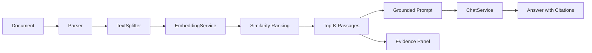

<div align="center">
  

# Java-RAG

**A framework-free, hackable RAG toolkit and visual playground for Java 8+**

Upload documents, ask grounded questions, and inspect the exact passages behind every answer.

[](https://github.com/ChinaYiqun/java-rag/actions/workflows/ci.yml)
[](https://www.oracle.com/java/technologies/javase/javase8-archive-downloads.html)
[](frontend)
[](LICENSE)
[](https://github.com/ChinaYiqun/java-rag/stargazers)

[English](README.md) · [简体中文](README_ch.md) · [Playground](docs/PLAYGROUND.md) · [Architecture](docs/ARCHITECTURE.md) · [Contributing](CONTRIBUTING.md)
</div>

---

Java-RAG is a pure-Java implementation of the complete RAG data flow:

```text
Document -> Parse -> Chunk -> Embed -> Retrieve -> Top-K Context -> Grounded Prompt -> Answer + Evidence
```

It is designed for developers who want to **learn RAG internals**, **embed RAG into an existing Java system**, or **replace individual providers without adopting Spring Boot or another mandatory application framework**.

## Launch the visual playground

The repository now includes a React three-panel workspace:

```text
Knowledge base | Grounded chat | Retrieval evidence
```

Start the complete frontend and Java backend with one command:

```bash
git clone https://github.com/ChinaYiqun/java-rag.git
cd java-rag
docker compose up --build
```

Open `http://localhost:3000`, upload a PDF/Word/Markdown file, ask a question, and inspect:

- the answer;
- cited document names;
- Chunk IDs;
- similarity scores;
- original Top-K passages.

The default mode is fully local and requires **no API key or model download**. An optional Ollama profile replaces the extractive demo generator with a real local language model:

```bash
RAG_PLAYGROUND_MODE=ollama docker compose --profile ollama up --build
```

See [the playground guide](docs/PLAYGROUND.md) for supported files, environment variables, API contracts and local development.

## Why Java-RAG?

- **Visual and inspectable** — the React playground displays knowledge-base state, conversation and retrieval evidence side by side.
- **Runnable with no API key** — both the browser playground and CLI demo can exercise retrieval, context construction and cited output locally.
- **Transparent pipeline** — query embeddings, chunk embeddings, ranking and Top-K context remain visible and testable.
- **Provider-neutral interfaces** — inject your own splitter, embedding service and OpenAI-compatible chat provider.
- **Java 8 compatible** — useful for existing enterprise and legacy JVM environments.
- **Real infrastructure building blocks** — file parsers, Redis, Elasticsearch, MinIO, MySQL, reranking and load-balancing code are included.
- **Security guardrails** — CI rejects credential-like values and runtime secrets are externalized.

## Run the CLI RAG flow in 60 seconds

No model download. No database. No API key.

```bash
bash scripts/run-no-api-demo.sh
```

Windows users without Bash can run the underlying Maven command:

```powershell
mvn -q -DskipTests compile org.codehaus.mojo:exec-maven-plugin:3.6.3:java -Dexec.mainClass=org.demo.NoApiKeyRagDemo
```

Expected output:

```text
Java-RAG: no API key demo
Question: Which option keeps prompts and model data on the local machine?

Top retrieved passage:
Ollama runs language models on the local machine...

Answer:
Offline extractive answer: Ollama runs language models on the local machine... [1]
```

The offline demo uses deterministic feature hashing and an extractive generator. It is intentionally simple: its purpose is to prove the full data flow locally, not to replace a production embedding model or LLM.

## How it works



`NaiveRAG` and the playground preserve the core behavior:

1. split source text into chunks;
2. embed the query once;
3. batch-embed all chunks;
4. rank chunks by distance;
5. inject only the selected Top-K passages into the prompt;
6. return the answer together with source metadata and original passages.

See [the architecture guide](docs/ARCHITECTURE.md) for extension points and maturity levels.

## Minimal Java example

```java
Document document = new Document("./handbook.pdf");

NaiveRAG rag = new NaiveRAG(document, "What is the refund policy?")
        .parsing()
        .chunking()
        .embedding()
        .sorting()
        .LLMChat();

System.out.println(rag.getResponse());
System.out.println(rag.getRetrievedChunks());
```

Configure real providers through environment variables or JVM system properties:

```bash
export RAG_API_KEY='replace-me'
export RAG_LLM_URL='https://your-provider.example/v1/chat/completions'
export RAG_EMBEDDING_API_URL='https://your-provider.example/v1/embeddings'
```

The full constructor accepts custom implementations:

```java
NaiveRAG rag = new NaiveRAG(
        document,
        question,
        textSplitter,
        embeddingService,
        chatService,
        embeddingUrl,
        chatUrl,
        model,
        4
);
```

## What is included

| Area | Capabilities |
|---|---|
| Visual playground | React 19 + TypeScript, document upload, chat, Top-K evidence and Docker Compose |
| Playground API | NanoHTTPD, in-memory knowledge base, upload/list/delete/chat JSON endpoints |
| RAG pipelines | Naive RAG, experimental Advanced RAG and Modular RAG |
| Parsing | PDF, Word, PowerPoint, Excel, Markdown and HTML |
| Chunking | Fixed-size, paragraph, sentence, recursive and semantic splitting |
| Embeddings | OpenAI-compatible/Baichuan-style services, Jina-related integrations, offline hashing demo |
| Retrieval | In-memory distance ranking, recall strategies, reranking components |
| Storage | Elasticsearch, Redis, MySQL and MinIO integrations |
| LLM access | OpenAI-compatible chat interface and optional Ollama generation |
| Agents | Multi-agent examples and tool-oriented building blocks |
| Operations | Nacos configuration, round-robin and weighted-random load balancing |

## Project status

| Component | Status | Meaning |
|---|---|---|
| Visual playground | **Usable** | Docker Compose starts React + Java API; uploads and evidence-linked chat work in memory |
| `NaiveRAG` grounded pipeline | **Usable** | Deterministic offline tests verify Top-K context reaches generation |
| External configuration and CI | **Usable** | Java 8 tests, secret guard, CLI demo and React build run on every PR |
| File parsers and infrastructure clients | **Available** | APIs exist; integration-test depth varies by component |
| `AdvancedRAG` / `ModularRAG` | **Experimental** | Planned to converge on a shared pipeline core |
| Persistent indexing, evaluation and observability | **Planned** | Vector persistence, retrieval metrics and trace artifacts are next milestones |

## Java-RAG vs larger Java AI frameworks

Java-RAG is not trying to replace the ecosystems around LangChain4j or Spring AI.

Use a larger framework when you want a broad provider catalog, framework integrations and a mature production abstraction. Use Java-RAG when you want:

- a small codebase that shows how RAG actually works;
- a browser demo where retrieval evidence is visible;
- framework-independent components for an existing Java application;
- a teaching, experimentation or interview project;
- direct control over chunking, retrieval, prompt construction and provider calls;
- Java 8 compatibility.

## Documentation

- [Visual playground and API](docs/PLAYGROUND.md)
- [Architecture and extension points](docs/ARCHITECTURE.md)
- [Installation](doc/install.md)
- [LLM conversations](doc/LLM.md)
- [Document parsing](doc/parser.md)
- [Chunking](doc/chunk.md)
- [Embeddings](doc/embedding.md)
- [Search and reranking](doc/search.md)
- [Advanced and modular pipelines](doc/pipeline.md)
- [Database integrations](doc/db.md)
- [Load balancing](doc/balance.md)
- [Security policy](SECURITY.md)

## Development

Backend:

```bash
bash scripts/run-playground-api.sh
```

Frontend:

```bash
cd frontend
npm install
npm run dev
```

Checks:

```bash
bash scripts/check-no-hardcoded-secrets.sh
mvn --batch-mode --no-transfer-progress test
bash scripts/run-no-api-demo.sh
cd frontend && npm install --no-audit --no-fund && npm run build
```

Contributions are welcome. Good first contributions include parser tests, splitter fixtures, persistent storage adapters, retrieval metadata, frontend improvements and documentation. See [CONTRIBUTING.md](CONTRIBUTING.md).

## Roadmap

- [x] Zero-key CLI RAG demo
- [x] React visual playground with evidence inspection
- [x] Docker Compose full-stack startup
- [ ] Shared `RagPipeline` core for Naive, Advanced and Modular modes
- [ ] Persistent vector index and asynchronous document ingestion
- [ ] Provider-neutral retrieval results with source metadata and scores
- [ ] Hybrid BM25 + vector retrieval example
- [ ] Reranking and query-rewrite examples
- [ ] Reproducible RAG evaluation suite
- [ ] Authentication, quotas and multi-knowledge-base isolation

## Security

Never commit API keys, passwords, tokens, `.env` files or private endpoints. Runtime credentials are loaded from environment variables or JVM properties. Uploaded document text is treated as untrusted data during prompt construction. Read [SECURITY.md](SECURITY.md) before deploying the infrastructure integrations.

## License

[Apache License 2.0](LICENSE)

---

If Java-RAG helps you understand or build RAG on the JVM, **star the repository** and share the visual playground with another Java developer. A star helps more developers discover a transparent, framework-free RAG path.
