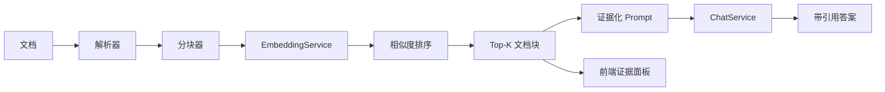

<div align="center">
  

# Java-RAG

**面向 Java 8+ 的无框架 RAG 工具箱与可视化 Playground**

上传文档、基于知识库提问，并直接查看每个答案真正命中的原文证据。

[](https://github.com/ChinaYiqun/java-rag/actions/workflows/ci.yml)
[](https://www.oracle.com/java/technologies/javase/javase8-archive-downloads.html)
[](frontend)
[](LICENSE)
[](https://github.com/ChinaYiqun/java-rag/stargazers)

[English](README.md) · [简体中文](README_ch.md) · [Playground](docs/PLAYGROUND.md) · [架构说明](docs/ARCHITECTURE.md) · [参与贡献](CONTRIBUTING.md)
</div>

---

Java-RAG 使用纯 Java 展示完整 RAG 数据链路：

```text
文档 -> 解析 -> 分块 -> 向量化 -> 检索 -> Top-K 上下文 -> Prompt -> 答案 + 证据
```

它适合三类开发者：

- 想真正理解 RAG 内部流程，而不是只会调用框架 API；
- 需要把 RAG 嵌入已有 Java 系统、银行系统或传统企业应用；
- 希望自由替换模型、向量服务、分块策略和存储，而不强制引入 Spring Boot。

## 一键启动可视化 Playground

仓库现在提供一个 React 三栏工作台：

```text
知识库 | AI 对话 | 检索证据
```

一条命令启动 React 前端和纯 Java 后端：

```bash
git clone https://github.com/ChinaYiqun/java-rag.git
cd java-rag
docker compose up --build
```

浏览器打开 `http://localhost:3000`，即可：

- 上传 PDF、Word、PPT、Excel、Markdown、TXT 等文件；
- 查看文档解析和分块结果；
- 基于知识库进行问答；
- 查看命中文档、Chunk ID、相似度和 Top-K 原文；
- 删除文档并重新构建当前内存知识库。

默认模式完全本地运行，**不需要 API Key，也不需要先下载模型**。需要真实本地大模型时，可启动 Ollama Profile：

```bash
RAG_PLAYGROUND_MODE=ollama docker compose --profile ollama up --build
```

详细说明见 [Playground 使用与 API 文档](docs/PLAYGROUND.md)。

## 为什么值得关注？

- **有真正的前端产品界面**：知识库、问答和证据并排展示，而不是只有后端类和接口；
- **零 Key 即可运行**：浏览器 Playground 和 CLI Demo 都能在本地跑通完整链路；
- **流程透明**：Query Embedding、Chunk Embedding、排序、Top-K 和最终 Prompt 都能检查；
- **证据不造假**：答案和右侧证据来自同一次后端检索结果；
- **接口可替换**：Splitter、EmbeddingService、ChatService 均可注入；
- **兼容 Java 8**：更适合传统企业和存量 JVM 环境；
- **包含真实工程组件**：文件解析、Redis、Elasticsearch、MinIO、MySQL、重排和负载均衡；
- **带安全护栏**：CI 检查硬编码凭据，运行时配置全部外置。

## 60 秒跑通命令行 RAG

无需 API Key、数据库和模型下载：

```bash
bash scripts/run-no-api-demo.sh
```

Windows 没有 Bash 时可直接执行：

```powershell
mvn -q -DskipTests compile org.codehaus.mojo:exec-maven-plugin:3.6.3:java -Dexec.mainClass=org.demo.NoApiKeyRagDemo
```

离线 Demo 使用确定性的 Feature Hashing 和抽取式生成器，目的是让你本地验证完整数据链路，不是假装替代生产级 Embedding 模型或大模型。

## 工作流程



当前 `NaiveRAG` 和 Playground 均保持这些核心原则：

1. Query Embedding 只计算一次；
2. 文档块批量向量化；
3. 根据相似度选择 Top-K；
4. 只把选中内容送入生成阶段；
5. 答案和原始检索证据一起返回。

## 最小 Java 示例

```java
Document document = new Document("./企业制度.pdf");

NaiveRAG rag = new NaiveRAG(document, "报销审批需要哪些材料？")
        .parsing()
        .chunking()
        .embedding()
        .sorting()
        .LLMChat();

System.out.println(rag.getResponse());
System.out.println(rag.getRetrievedChunks());
```

真实模型配置使用环境变量或 JVM 参数：

```bash
export RAG_API_KEY='replace-me'
export RAG_LLM_URL='https://your-provider.example/v1/chat/completions'
export RAG_EMBEDDING_API_URL='https://your-provider.example/v1/embeddings'
```

## 已包含能力

| 领域 | 能力 |
|---|---|
| 可视化 Playground | React 19 + TypeScript、文档上传、知识问答、Top-K 证据、Docker Compose |
| Playground API | NanoHTTPD、内存知识库、上传/列表/删除/问答 JSON API |
| RAG Pipeline | Naive RAG、实验性 Advanced RAG、Modular RAG |
| 文档解析 | PDF、Word、PowerPoint、Excel、Markdown、HTML |
| 分块 | 固定长度、段落、句子、递归、语义分块 |
| 向量化 | OpenAI 兼容/百川风格接口、Jina 相关实现、离线 Hashing Demo |
| 检索 | 内存距离排序、多路召回、重排组件 |
| 存储 | Elasticsearch、Redis、MySQL、MinIO |
| 模型调用 | OpenAI 兼容 Chat 接口、可选 Ollama 本地生成 |
| Agent | 多 Agent 示例和工具调用基础组件 |

## 当前成熟度

| 模块 | 状态 | 说明 |
|---|---|---|
| 可视化 Playground | **可用** | Compose 启动 React + Java API，支持上传、问答和证据展示 |
| `NaiveRAG` 证据化流程 | **可用** | 离线测试验证 Top-K 文档块确实进入生成阶段 |
| 配置与 CI | **可用** | Java 8 测试、凭据检查、CLI Demo 和 React Build 每次 PR 都运行 |
| 文档解析和基础设施客户端 | **已提供** | 不同组件的集成测试深度仍有差异 |
| `AdvancedRAG` / `ModularRAG` | **实验中** | 后续统一到共享 Pipeline Core |
| 持久化索引、评测和可观测性 | **规划中** | 将补向量持久化、检索指标和运行证据 |

## 与 LangChain4j、Spring AI 的区别

Java-RAG 不试图替代成熟 Java AI 框架。需要大量 Provider、框架生态和成熟生产抽象时，可以优先使用 LangChain4j 或 Spring AI。

下面这些情况更适合 Java-RAG：

- 想看懂 RAG 每一步到底做了什么；
- 需要一个可以直接演示的可视化项目；
- 已有传统 Java 项目，不希望强制迁移框架；
- 希望直接控制分块、检索、Prompt、证据和模型调用；
- 必须兼容 Java 8。

## 文档导航

- [Playground 使用与 API](docs/PLAYGROUND.md)
- [架构与扩展点](docs/ARCHITECTURE.md)
- [安装教程](doc/install.md)
- [LLM 对话](doc/LLM.md)
- [文档解析](doc/parser.md)
- [分块策略](doc/chunk.md)
- [Embedding](doc/embedding.md)
- [搜索与重排](doc/search.md)
- [数据库集成](doc/db.md)
- [安全说明](SECURITY.md)

## 本地开发

启动 Java API：

```bash
bash scripts/run-playground-api.sh
```

启动 React：

```bash
cd frontend
npm install
npm run dev
```

完整检查：

```bash
bash scripts/check-no-hardcoded-secrets.sh
mvn --batch-mode --no-transfer-progress test
bash scripts/run-no-api-demo.sh
cd frontend && npm install --no-audit --no-fund && npm run build
```

欢迎参与。适合首次贡献的任务包括：Parser/Splitter 测试、持久化存储、检索结果元数据、前端交互和中英文文档。详见 [CONTRIBUTING.md](CONTRIBUTING.md)。

## Roadmap

- [x] 零 Key CLI RAG Demo
- [x] 带证据展示的 React 可视化 Playground
- [x] Docker Compose 前后端一键启动
- [ ] 提取 Naive、Advanced、Modular 共用的 `RagPipeline` Core
- [ ] 持久化向量索引和异步文档处理
- [ ] 统一带来源、分数和元数据的检索结果对象
- [ ] 增加 BM25 + Vector 混合检索
- [ ] 增加重排、Query Rewrite 和评测套件
- [ ] 增加登录、配额和多知识库隔离

## 安全

禁止提交 API Key、密码、Token、`.env` 文件和私有服务地址。运行时凭据从环境变量或 JVM 参数读取。上传文档在 Prompt 构造阶段被视为不可信数据。部署前请阅读 [SECURITY.md](SECURITY.md)。

## License

[Apache License 2.0](LICENSE)

---

如果 Java-RAG 帮你理解或搭建了 Java RAG，欢迎点一个 **Star**，也可以把可视化 Playground 分享给其他 Java 开发者。
